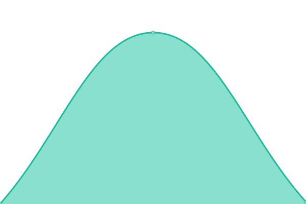

# [📈 Live Status](https://Tanic-Labs.github.io/telegai-status): <!--live status--> **🟥 Complete outage**

This repository contains the open-source uptime monitor and status page for [TelegAI](https://www.telegai.com), powered by [Upptime](https://github.com/upptime/upptime).

With [Upptime](https://upptime.js.org), you can get your own unlimited and free uptime monitor and status page, powered entirely by a GitHub repository. We use [Issues](https://github.com/Tanic-Labs/telegai-status/issues) as incident reports, [Actions](https://github.com/Tanic-Labs/telegai-status/actions) as uptime monitors, and [Pages](https://Tanic-Labs.github.io/telegai-status) for the status page.

<!--start: status pages-->
<!-- This summary is generated by Upptime (https://github.com/upptime/upptime) -->
<!-- Do not edit this manually, your changes will be overwritten -->
<!-- prettier-ignore -->
| URL | Status | History | Response Time | Uptime |
| --- | ------ | ------- | ------------- | ------ |
|  [Web](https://www.telegai.com/) | 🟥 Down | [web.yml](https://github.com/Tanic-Labs/telegai-status/commits/HEAD/history/web.yml) | 

 242ms
     
 | 

<a href="https://Tanic-Labs.github.io/telegai-status/history/web">100.00%</a>
    

|  [Image Rotation](https://ywqesktuqvgsmrgraors.supabase.co/functions/v1/angle-rotation-wavespeed) | 🟥 Down | [image-rotation.yml](https://github.com/Tanic-Labs/telegai-status/commits/HEAD/history/image-rotation.yml) | 

 358ms
     
 | 

<a href="https://Tanic-Labs.github.io/telegai-status/history/image-rotation">100.00%</a>
    

|  [Audio Generation](https://ywqesktuqvgsmrgraors.supabase.co/functions/v1/chatterbox-tts) | 🟥 Down | [audio-generation.yml](https://github.com/Tanic-Labs/telegai-status/commits/HEAD/history/audio-generation.yml) | 

 148ms
     
 | 

<a href="https://Tanic-Labs.github.io/telegai-status/history/audio-generation">100.00%</a>
    

|  [Voice Generator](https://ywqesktuqvgsmrgraors.supabase.co/functions/v1/generate-voice-candidates) | 🟥 Down | [voice-generator.yml](https://github.com/Tanic-Labs/telegai-status/commits/HEAD/history/voice-generator.yml) | 

 202ms
     
 | 

<a href="https://Tanic-Labs.github.io/telegai-status/history/voice-generator">100.00%</a>
    

|  [Voice Creator](https://ywqesktuqvgsmrgraors.supabase.co/functions/v1/generate-voice-from-candidate) | 🟥 Down | [voice-creator.yml](https://github.com/Tanic-Labs/telegai-status/commits/HEAD/history/voice-creator.yml) | 

 297ms
     
 | 

<a href="https://Tanic-Labs.github.io/telegai-status/history/voice-creator">100.00%</a>
    

|  [Image Generation](https://ywqesktuqvgsmrgraors.supabase.co/functions/v1/qwen-image-edit) | 🟥 Down | [image-generation.yml](https://github.com/Tanic-Labs/telegai-status/commits/HEAD/history/image-generation.yml) | 

 294ms
     
 | 

<a href="https://Tanic-Labs.github.io/telegai-status/history/image-generation">100.00%</a>
    

|  [Video Generation](https://ywqesktuqvgsmrgraors.supabase.co/functions/v1/wan-video-generation) | 🟥 Down | [video-generation.yml](https://github.com/Tanic-Labs/telegai-status/commits/HEAD/history/video-generation.yml) | 

 302ms
     
 | 

<a href="https://Tanic-Labs.github.io/telegai-status/history/video-generation">100.00%</a>
    

|  [Database](https://ywqesktuqvgsmrgraors.supabase.co/rest/v1/) | 🟥 Down | [database.yml](https://github.com/Tanic-Labs/telegai-status/commits/HEAD/history/database.yml) | 

 17ms
     
 | 

<a href="https://Tanic-Labs.github.io/telegai-status/history/database">100.00%</a>
    

|  [Standard LLM](https://openrouter.ai/api/v1/models) | 🟥 Down | [standard-llm.yml](https://github.com/Tanic-Labs/telegai-status/commits/HEAD/history/standard-llm.yml) | 

 5103ms
     
 | 

<a href="https://Tanic-Labs.github.io/telegai-status/history/standard-llm">99.93%</a>
    

|  [Context & Reasoning](https://api.novita.ai/v3/openai/models) | 🟥 Down | [context-and-reasoning.yml](https://github.com/Tanic-Labs/telegai-status/commits/HEAD/history/context-and-reasoning.yml) | 

 536ms
     
 | 

<a href="https://Tanic-Labs.github.io/telegai-status/history/context-and-reasoning">100.00%</a>
    

<!--end: status pages-->

[**Visit our status website →**](https://Tanic-Labs.github.io/telegai-status)

## 📄 License

- Powered by: [Upptime](https://github.com/upptime/upptime)
- Code: [MIT](./LICENSE) © [Tanic Labs](https://github.com/Tanic-Labs)
- Data in the `./history` directory: [Open Database License](https://opendatacommons.org/licenses/odbl/1-0/)
